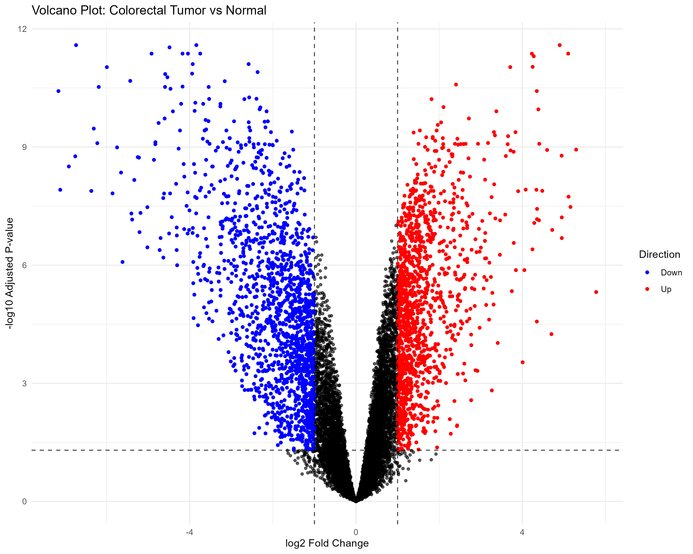

# Drug Repurposing with Connectivity Map (CMap)

This project explores **drug repurposing** using gene expression data.  
The goal is to identify **differentially expressed genes (DEGs)** between **tumor vs normal samples** and then use the **Connectivity Map (CMap / CLUE)** to find drugs that could potentially *reverse* the cancer gene signature.  

---

## 🚀 Project Overview
1. **Dataset:**  
   - Source: GEO dataset [GSE142279](https://www.ncbi.nlm.nih.gov/geo/query/acc.cgi?acc=GSE142279)  
   - Samples: 40 colorectal tissue samples (20 tumor, 20 matched normal)  
   - Perfect paired design → tumor and normal from the same patient  

2. **Analysis:**  
   - Performed differential expression analysis (tumor vs normal)  
   - Identified **2,882 significant DEGs**  
     - **1,306 upregulated in tumor**  
     - **1,576 downregulated in tumor**  
   - Results highly significant (adjusted p-values as low as 10^-16)  

3. **Visualization:**  
   - Volcano plot shows clear separation of upregulated (red) and downregulated (blue) genes:  

   

4. **Next Steps:**  
   - Extract **top 150 upregulated** and **top 150 downregulated** genes  
   - Submit to **Connectivity Map (CMap/CLUE)**  
   - Identify candidate drugs that may reverse the tumor gene signature  

---

## 📦 Tools & Packages
### R / Bioconductor
- `DESeq2`, `limma`, `edgeR` → differential expression  
- `GEOquery` → dataset retrieval  
- `biomaRt`, `org.Hs.eg.db`, `AnnotationDbi` → gene annotation  

### Visualization
- `ggplot2`, `EnhancedVolcano`, `pheatmap`, `ComplexHeatmap`  

---

## 📊 Results Summary
- **2,882 significant DEGs** detected  
- **Upregulated genes (n=1,306):** higher expression in tumor  
- **Downregulated genes (n=1,576):** lower expression in tumor  
- Gene lists are **ready for CMap submission**  

---

## 🔮 Roadmap
- [x] Download and preprocess GEO dataset  
- [x] Run DEG analysis (tumor vs normal)  
- [x] Generate volcano plot + DEG summary  
- [ ] Prepare CMap input (top 150 up + 150 down)  
- [ ] Submit to CMap and analyze drug predictions  
- [ ] Summarize candidate compounds  
