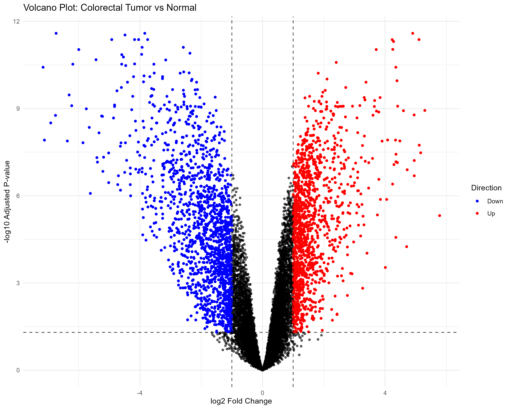

# Drug Repurposing with Connectivity Map (CMap)

This project explores **drug repurposing** using gene expression data.  
The goal is to identify **differentially expressed genes (DEGs)** between **tumor vs normal samples** and then use the **Connectivity Map (CMap / CLUE)** to find drugs that could potentially *reverse* the cancer gene signature.  

---

## 🚀 Project Overview
1. **Dataset:**  
   - Source: GEO dataset [GSE142279](https://www.ncbi.nlm.nih.gov/geo/query/acc.cgi?acc=GSE142279)  
   - Samples: 40 colorectal tissue samples (20 tumor, 20 matched normal)  
   - Perfect paired design → tumor and normal from the same patient  

2. **Analysis:**  
   - Performed differential expression analysis (tumor vs normal)  
   - Identified **2,882 significant DEGs**  
     - **1,306 upregulated in tumor**  
     - **1,576 downregulated in tumor**  
   - Results highly significant (adjusted p-values as low as 10^-16)  

3. **Visualization:**  
   - Volcano plot shows clear separation of upregulated (red) and downregulated (blue) genes:  

   

4. **Next Steps:**  
   - Extract **top 150 upregulated** and **top 150 downregulated** genes  
   - Submit to **Connectivity Map (CMap/CLUE)**  
   - Identify candidate drugs that may reverse the tumor gene signature  

---

## 📦 Tools & Packages

### Bioconductor
- **limma** — linear modeling for differential expression  
- **edgeR** — count-based RNA-seq DE with negative binomial models  
- **GEOquery** — download/parse GEO series/platforms  
- **recount3** — access uniformly processed RNA-seq data  

### CRAN
- **tidyverse** — dplyr, ggplot2, readr, tibble, etc.  
- **pheatmap** — heatmaps  
- **R.utils** — utilities (e.g., file ops, gunzip helpers)  

### Visualization
- **ggplot2**, **EnhancedVolcano**, **pheatmap**, **ComplexHeatmap**  

---

## 📊 Differential Expression Results
- **2,882 significant DEGs** detected (adj. p < 0.05)  
  - **Upregulated genes (n=1,306):** higher expression in tumor  
  - **Downregulated genes (n=1,576):** lower expression in tumor  
- Volcano plot confirms clear separation of tumor vs normal expression profiles.  
- Gene lists prepared for CMap submission (top 150 up + 150 down).  

---

## 🧪 Detailed Results Analysis (CMap)

We submitted the DEG signature to **CMap (Touchstone 1.0)**.  
CMap compares our tumor profile against thousands of **drug-induced gene expression signatures**.  
- **Compounds tested:** ~2,400  
- **Output metric:** Connectivity score (τ), ranges from +100 (mimics tumor) to –100 (reverses tumor)  
- **Interpretation:** Strong *negative* τ scores indicate compounds that may counteract tumor programs.  

### 🔹 Top 10 Compounds

| Rank | Compound                          | Mechanism of Action (MoA)        | τ Score |
|------|-----------------------------------|-----------------------------------|---------|
| 1    | PKC activator (class)             | Protein kinase C activation       | –98.45  |
| 2    | Prostratin                        | PKC activator                     | –97.89  |
| 3    | Avrainvillamide-analog-3          | Nucleophosmin inhibitor           | –97.43  |
| 4    | Ingenol                           | PKC activator                     | –97.37  |
| 5    | Phorbol-12-myristate-13-acetate   | PKC activator                     | –96.58  |
| 6    | ON-01910 (Rigosertib)             | PLK inhibitor                     | –96.43  |
| 7    | Scoulerine                        | Adrenergic receptor antagonist    | –96.21  |
| 8    | Vinorelbine                       | Tubulin inhibitor                 | –95.17  |
| 9    | MLN-8054                          | Aurora kinase inhibitor           | –94.80  |
| 10   | SB-216763                         | Glycogen synthase kinase inhibitor| –94.68  |

---

### 🔹 Interpretation
- **PKC activators** dominate the top hits (Prostratin, Ingenol, PMA), suggesting **PKC signaling modulation** strongly reverses the tumor gene signature.  
- **Cell cycle/mitotic inhibitors** (Aurora kinase inhibitor MLN-8054, PLK inhibitor ON-01910, tubulin inhibitor Vinorelbine) also ranked highly, consistent with the proliferative nature of colorectal tumors.  
- **Metabolic & structural agents** like scoulerine and avrainvillamide analogs appeared, though these remain less characterized.  
- Several compounds (Vinorelbine, Rigosertib) are clinically relevant, highlighting potential for repurposing.  

---

## ⚠️ Limitations & Biological Context

1. **CMap limitations**  
   - Signatures derived from **immortalized cell lines**, not patient tissue.  
   - Gene expression reversal does not always predict therapeutic efficacy.  

2. **Statistical considerations**  
   - τ scores are rank-based and relative.  
   - Multiple testing across thousands of compounds → false positives possible.  

3. **Biological context**  
   - **PKC signaling** is dysregulated in colorectal cancer, making PKC modulators biologically plausible.  
   - **Mitotic checkpoint disruption** (Aurora/PLK inhibition) aligns with known vulnerabilities of rapidly dividing tumor cells.  
   - **Tubulin inhibitors** (e.g., Vinorelbine) are already part of clinical chemotherapy regimens, supporting the validity of CMap predictions.  

4. **Need for validation**  
   - Computational predictions should be followed by:  
     - **In vitro assays** (CRC cell lines, organoids)  
     - **Cross-validation with PRISM cell viability datasets**  
     - **Literature review of each compound in colorectal cancer context**  

---

## 🔮 Roadmap
- [x] Download and preprocess GEO dataset  
- [x] Run DEG analysis (tumor vs normal)  
- [x] Generate volcano plot + DEG summary  
- [x] Submit signature to CMap (Touchstone 1.0)  
- [x] Summarize top compounds and MoAs  
- [ ] Annotate FDA-approved vs experimental compounds  
- [ ] Cross-check hits with PRISM viability data  
- [ ] Add literature review for top candidates  
- [ ] Propose validation experiments  

---

## ⚙️ Reproducibility
All analysis performed in **R (v4.x)**.  

Install required packages:

```r
if (!requireNamespace("BiocManager", quietly = TRUE)) install.packages("BiocManager")
BiocManager::install(c("limma", "edgeR", "GEOquery", "recount3"))
install.packages(c("tidyverse", "pheatmap", "R.utils"))
